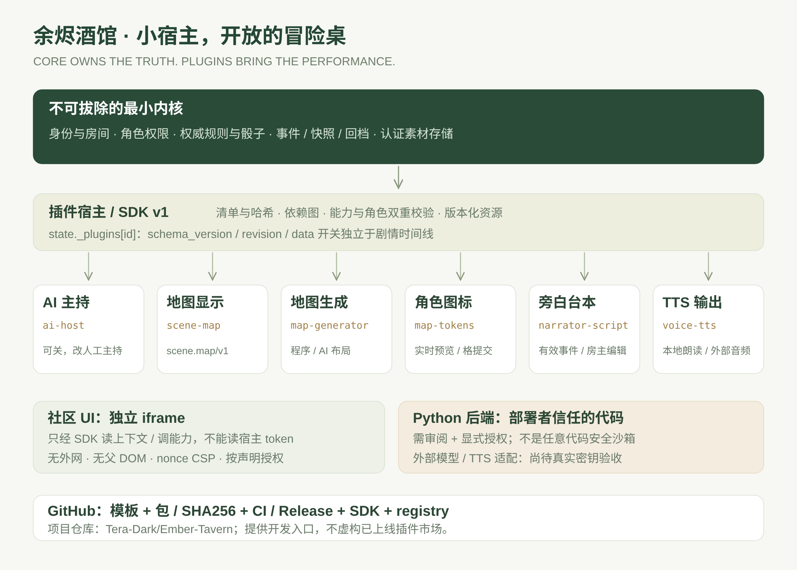

# 余烬酒馆 · 产品需求与模块化架构 PRD v2.0

版本：2.1.0-beta.1 · 日期：2026-09-30 · 插件 API：1

> 从可运行的 V1 升级，不是重画静态原型。V1 账号、房间、权限、通用轻规则、双模型适配、事件与回档保留；新增小宿主、独立开关模块、方格场景、实时图标、台本、双模式 TTS 和可发布 GitHub 插件 SDK。真实模型／TTS 密钥尚未提供；项目仓库为 https://github.com/Tera-Dark/Ember-Tavern，当前为测试版。

## 1. 产品方向

为一位房主和一桌朋友提供浏览器多人轻规则叙事冒险。房主设置世界、分配角色、干预 AI、纠错和回档。玩家用自然语言行动，服务端校验角色、属性、骰子与规则，模型负责知识和叙事决策。

核心原则是 **“内核守正史，插件做演绎”**。地图、旁白、声音不应迫使用户使用复杂 VTT；关掉它们，仍能完整跑团。社区开发者可以扩展桌面，而不是 fork 整个宿主。

用户已选：通用轻规则、AI 主持可干预、Gemini 知识＋OpenAI 兼容决策接口、俯视方格地图、浏览器朗读＋外部 TTS。未确认 jev 的具体身份，不把不确定服务写死。

## 2. 用户与边界

| 身份 | 核心权限 |
| --- | --- |
| 房主 | 建房、世界设定、角色分配／属性纠错、模型模式、模块开关、全角色移动、台本编辑、音频生成、回档 |
| 玩家 | 加房、发送自己角色行动、骰子、阅读公共资料；地图只移动分配给自己的角色；本地朗读 |
| 游客 | 无密钥演示试玩；不能使用付费真实模型／服务端 TTS |
| 部署者 | 保存密钥、审核 Python 插件／高风险 UI、安装包、备份与恢复、发布 GitHub 仓库 |
| 社区作者 | 只读 UI 或经审核后端模块；不得绕过内核规则与房间成员认证 |

非本轮范围：完整 D&D／CoC 规则书兼容、战棋路径／先攻／视线、多人语音会议、商业插件付费市场、任意 GitHub 自动执行、多人协作编辑台本、生产费用硬额度和公网 SLA。

## 3. 最小宿主不可拔除的责任

- 身份、会话、房间成员、房主／玩家权限与角色控制权。
- 服务端权威状态、通用规则执行、骰子、行动与主持轮次。
- 事件、快照、分支回档、幂等请求、有效时间线检索、导出。
- 插件发现、清单校验、依赖／资源冲突、能力路由与错误隔离。
- 受保护的素材存储、WebSocket 通道、iframe 沙箱与安全上下文。
- 模型／TTS 共用服务适配器和配置管理；密钥只在服务端。

内核不能被关掉，也不能把第三方插件“声明了权限”等同于免审代码。Python 插件是部署者信任的服务器代码，不是可运行任意恶意代码的沙箱。



## 4. 内置六模块

| ID / 模块 | 默认 | 依赖 | 提供能力 |
| --- | --- | --- | --- |
| ai-host / AI 主持 | 开 | 无 | gm 主持钩子；可换提供者；关后改人工补述 |
| scene-map / 场景地图 | 关 | 无 | scene.map/v1；共享 SVG 方格渲染 |
| map-generator / 地图生成器 | 关 | scene-map | 4 种地形、固定种子、程序布局；可配置 AI 结构化布局 |
| map-tokens / 角色图标与移动 | 关 | scene-map | scene.tokens/v1；分配角色权限、格移动、WS 拖动预览 |
| narrator-script / 旁白台本 | 关 | 无 | 有效事件分段、说话者、房主编辑／重建 |
| voice-tts / TTS 旁白 | 关 | narrator-script | 本地朗读、外部音频生成、认证播放／下载 |

另提供独立 UI 社区示例 session-insights，会话观察板；不注册进宿主源码。模块可以独立停止生成，但保留展示：例如关闭 map-generator 不关闭已有场景；关闭 map-tokens 仅移除图标／移动。

## 5. 插件安装与开关体验

房间导航新增「模块中心」。卡片显示来源、版本、简介、依赖与可用状态。开启插件自动开启必须依赖；关闭底座前确认级联关闭依赖者。关闭不删除已生成地图、位置、台本或音频引用。

模块 UI 来自 manifest，自动按 group／slot 构成导航与面板。安装只读 UI ZIP 后刷新清单即可使用，不需要修改宿主 App 或重新构建前端。高风险 UI 能力与 Python 后端须部署者显式审核授权；普通玩家不能切换模块。

同一版本化资源契约／gm 主持钩子不允许同时启用两个提供者，避免随机选择。当前依赖是插件 ID，不是自动解析语义版本范围。

## 6. 地图与实时图标

- 俯视方格，默认 24 × 16；提供港口、遗迹、森林、洞穴主题与可重复种子。
- 程序生成无需任何密钥；AI 模式是结构化网格，不承诺美术图像。未配置时禁止选择；调用失败明确报错，不伪造成功或静默降级。
- 新地图重新安置角色，图标与地图 ID 关联。地图作者的模块可替换，渲染读取资源而不是模型输出原文。
- 拖动过程中，其他在线成员看到浮点预览；最多 30 信号／秒，不写事件、不改变权威格位置。
- 松手后整数目标格由服务端校验；房主可移动所有角色，玩家只能移动自己角色。
- 校验格边界、障碍、地图 ID、namespace revision、branch。合法移动才落事件与快照；并发冲突拒绝而非最后写入覆盖。
- 地图 UI 隔离渲染；放大、窗口适配、角色选择、鼠标／触摸拖动；取消手势或换时间线重置预览。

## 7. 台本与双模式 TTS

旁白台本由有效剧情事件生成最多 40 个片段；房主可改说话者／文字、从剧情重建。台本编辑不篡改场景正史，作为演绎数据单独记录。

**浏览器朗读**：使用用户浏览器与操作系统 voice。无服务器音频文件、无下载、设备可用性不同；不能说成已生成 MP3。每人本地播放，不是全房间同步语音广播。

**外部 TTS**：服务端可配置 OpenAI 兼容 `/audio/speech` 接口、模型和 voice。只有正式账号房主可合成，单返回音频最多 5 MiB；存入宿主通用素材仓，返回元数据而不是把二进制塞进数据库。成员在模块开启且当前时间线仍引用时才能播放／下载。

未给真实供应商密钥时界面显示“未配置”，给 key 后显示“配置待调用验证”，绝不把配置存在当成供应商已验收。外部 TTS 的 MockTransport 测试只验证请求／文件／权限契约，不证明真实听感或可解码音频。

## 8. 状态、回档与并发

```text
最小内核 core state
  └── state._plugins[plugin-id]
      ├── schema_version
      ├── revision
      └── data
          └── _assets[]  当前素材引用（可选）

独立房间配置 room_plugins.flags_json
  └── enabled / disabled  不属于剧情时间线
```

完整事件快照包含所有 namespace；回档恢复地图、位置、台本、音频引用以及原有世界与角色属性。开关、成员、角色控制者属于运行配置，不随剧情回档。废弃分支封存，不进入有效检索；旧分支音频引用不能从当前素材接口读取。

插件动作以自身 revision＋branch 进行乐观并发，按 room/plugin 加锁，request_key 幂等。异步生成结束核验读取依赖；模型生成期间合法地图提交不会被旧 GM 快照抹掉。

外部网络调用不能回滚费用。关闭／回档／冲突可能留下已收费且未引用的文件；未来需任务队列、供应商幂等与保留期 GC。当前不承诺分布式事务或 exactly-once 计费。

## 9. 安全设计

- UI：独立 `/plugin-frame/{id}` 文档、nonce CSP、sandbox 仅 allow-scripts；不允许网络、父 DOM、外部脚本、表单和嵌套 frame。
- 桥接：随机 channel、event.source 核验、manifest capability、服务端角色／依赖再次校验；登录令牌仅父宿主持有。
- 只读社区 UI 可直接安装；非只读能力须 `--grant-capabilities`，Python 须 `--trust-backend`。信任绑定文件哈希，修改后重新审查。
- 安装器拒绝路径穿越、符号链接、过大 ZIP、覆盖内置插件与现有安装；HTTPS 远程包必须带 SHA256。
- 资源／状态：契约版本化，单 namespace 256 KiB；最多 16 次跨模块调度、8 个写 namespace；错误钩子隔离。
- 密钥不下发浏览器、不进 Git、不进项目 ZIP。用户应把凭据写在部署环境，不要发聊天、世界书或插件 UI。

宿主仍是小团体 MVP：单 worker、SQLite WAL、进程内 WS、未进行公网压测和独立安全审计；上线开放注册和付费调用前必须另做限额、监控、恢复演练及供应商真实验收。

## 10. GitHub 社区生态交付

```text
.github/              CI、插件 Release、问题模板、PR 模板
plugins/              六个内置模块与审阅哈希锁
templates/            独立可安装 UI 示例
plugin-packages/      示例 ZIP 与真实 SHA256
registry/index.json   可发布的清单；未发布 URL 为 null
scripts/plugins.py    打包、安装与显式信任 CLI
CONTRIBUTING.md       契约、测试、版本与审核
SECURITY.md           UI／后端边界和漏洞报告
LICENSE.example       MIT 模板；发布前由拥有者选择许可证
```

项目仓库为 https://github.com/Tera-Dark/Ember-Tavern，提供可发布的插件开发基础，不宣称已有活跃社区或在线市场。没有虚构开发者、下载量、插件市场 URL；正式开源许可证仍由拥有者决定。tag 工作流与 Actions 的实际执行结果以 GitHub 为准。

## 11. 验收清单

| 验收项 | 判定标准 |
| --- | --- |
| 轻内核 | 关闭地图／声音／AI 后账号、房间、行动、权限、事件和回档继续可用 |
| 插件即插即用 | session-insights ZIP 安装发现、开启和动态导航不改宿主源码／前端入口 |
| 依赖开关 | 自动补齐、级联确认、玩家禁改、关闭保留数据 |
| 地图 | 固定 seed 可重复、合法格校验、自己的角色可控／别人的拒绝 |
| 实时拖动 | 双浏览器拖动预览可见但 DB revision 不变；松手后落事件 |
| 时间线 | 地图／台本回档、开关不回档、旧 branch 请求拒绝 |
| 并发 | GM 延迟期间地图提交保留；插件自身／依赖变更拒绝旧结果 |
| 语音 | 本地桥明确不保存；Mock 验证外部请求／认证素材／回档拒绝旧音频 |
| 隔离 | iframe 不能读 parent.document／token；未授权 Python 不执行 |
| 工程交付 | 自动测试、浏览器报告、源码 ZIP、Word PRD、SDK、备份恢复脚本 |

测试执行结果与限制以 `docs/TEST_REPORT.md` 为准；真实 Gemini／决策 API／TTS、Docker 镜像构建和公网部署不因 Mock 测试而视为通过。

## 12. 后续路线

- P1：真实供应商验收、异步任务／取消令牌／幂等、素材配额与清理、按用户费用限制。
- P1：宿主支持的 schema migration 回归样本、插件升级／停用可视化、版本兼容清单与签名发布。
- P2：图片地图插件、迷雾／视线／路径插件、不同规则主持提供者、多人同步演绎轨道。
- P2：多 worker 共享消息与 Redis／PostgreSQL、公开市场索引、独立权限授权界面与安全审核流程。

V1 详细业务需求存档：`docs/archive/PRD_v1.md`。插件作者入口：`docs/PLUGIN_SDK.md`。发布者入口：`docs/GITHUB_PUBLISH.md`。

## 13. 桌面实例启动器

启动器版本 0.1.0-beta.1。Windows x64，Go + WebView2，管理实例而非耦合跑团业务；按用户提供的集中式启动器设计理念实现深色首页、搜索、实例卡片与任务入口。

首次自动准备 Python / pip 环境、固定 GitHub 源码、依赖与健康检查，正常使用无需手动安装 Git / Node。更新备份、数据副本预检、版本化依赖与原地目录替换；事务 journal 与自动恢复。设置只保存于本机，不回显密钥。

默认管理接口仅本机，游戏端口可选择可信局域网；实例独立数据与进程，不能把不同实例邀请码混用。

本轮已构建 Windows EXE；Linux 集成与浏览器验收通过，不等于 Windows WebView2 / Installer / SmartScreen 已实机通过。见 docs/LAUNCHER_TEST_REPORT.md。
